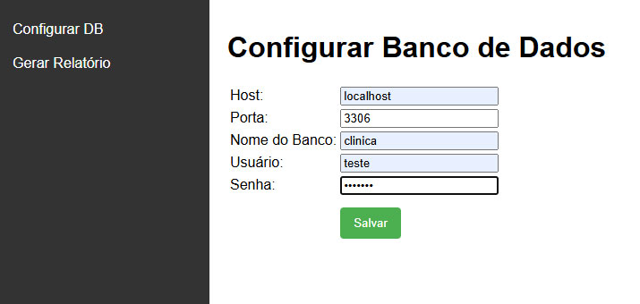
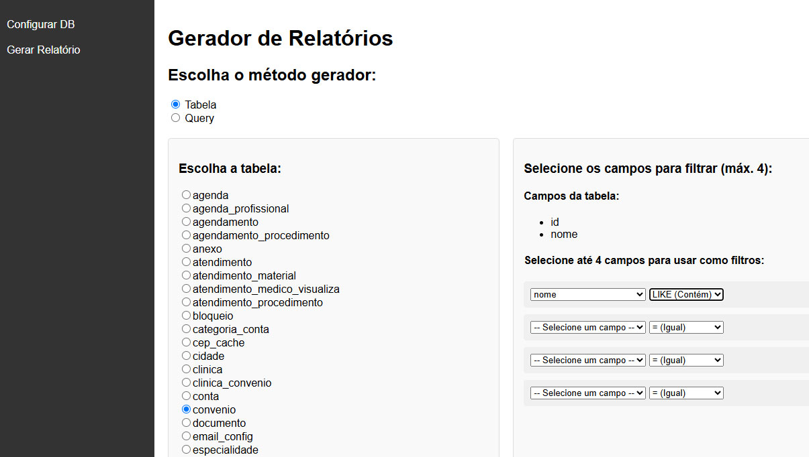
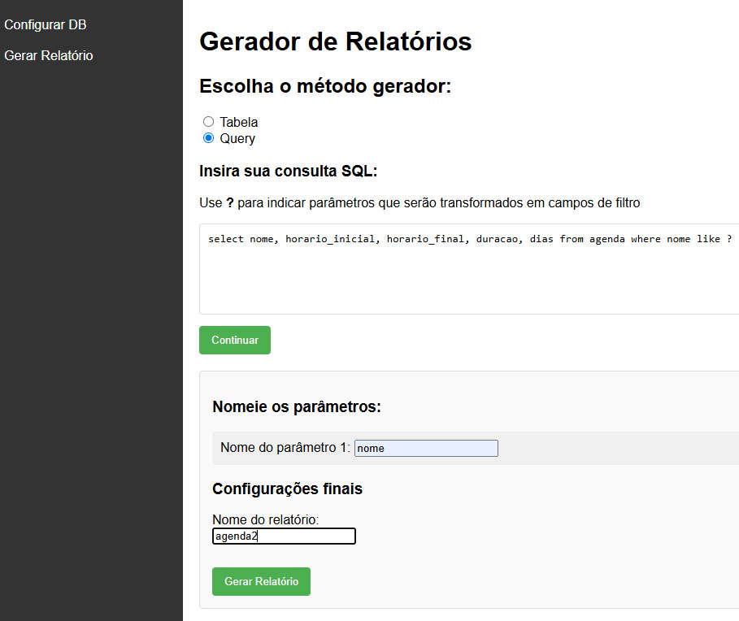
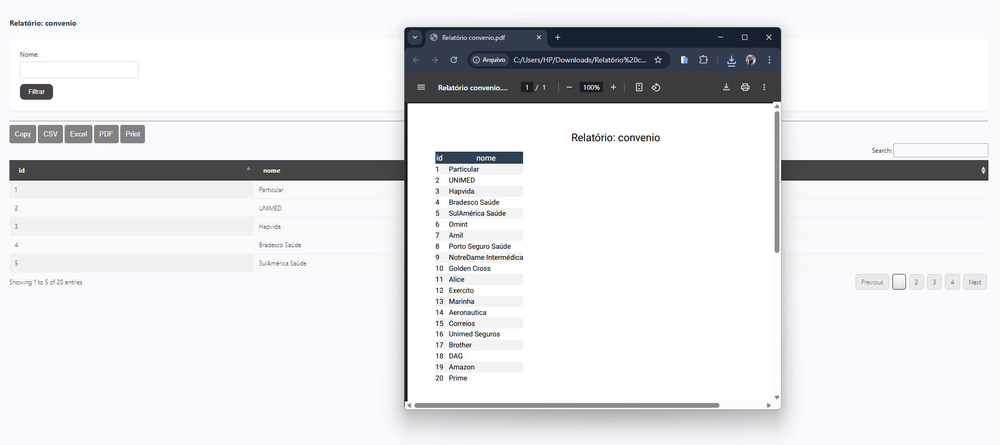

# 📄 Gerador de Relatórios em PHP para MySQL


## ✨ Objetivo
Este projeto tem como objetivo fornecer uma solução moderna e eficiente para Criar seus relatórios com base em tabelas do banco mysql ou querys. 

## 📋 Descrição
Projeto Simples, mas totalmente customizável, que vai ajudar bastante na agilidade de suas entregas no quesito relatórios.

## 🛠️ Instalação
Siga estes passos para configurar o projeto em seu ambiente local:

1. **Pré-requisitos**:
   - PHP 8.0 ou superior
   - MySQL 5.7 ou superior
   - Apache/Nginx
   - Não necessita de Composer 

2. **Configuração**:
   ```bash
   git clone https://github.com/geraldopatricio/phpReportGenerate.git
   cd https://github.com/geraldopatricio/phpReportGenerate.git
   siga os passos das imagens abaixo
   ```

3. **Banco de Dados**:
   ```sql
   Fica a seu critério, pois vai servir justamente para ler suas bases, ok.
   ```

4. **Configurações**:
   - "Talvez" precise mudar algo no seu php.ini, portanto fique atento as mensagens de alertas.

5. **Iniciar**:
   ```bash
   php -S localhost:8000
   ```

## 💻 Tecnologias Utilizadas

<div style="display: flex; justify-content: center; gap: 20px; margin: 20px 0;">
  
  
  
  
</div>

## 🎥 Video Demonstration

[](https://youtu.be/MNjB-Q_pTME)

## 📸 Screenshots

<div style="display: grid; grid-template-columns: repeat(2, 1fr); gap: 10px;">
  
  
  
  
  
</div>

## 📞 Contato & Suporte

Entre em contato conosco para suporte, dúvidas ou parcerias:

<div style="display: flex; justify-content: center; gap: 15px; margin: 20px 0;">
  <a href="https://instagram.com/patriciomelofilho" target="_blank">
    
  </a>
  <a href="https://wa.me/5585991508104" target="_blank">
    
  </a>
  <a href="mailto:geraldo@gpsoft.net.br">
    
  </a>
</div>

**E-mail:** geraldo@gpsoft.net.br ou Paypal Doações: gpatricio.melo@gmail.com  
**WhatsApp:** (85) 99150-8104  
**Horário de atendimento:** Seg-Sex, 9h-18h

---

Desenvolvido com ❤️ por [GPSOFT - Geraldo P Melo] - © 2025
